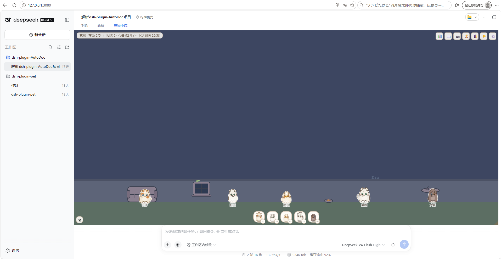
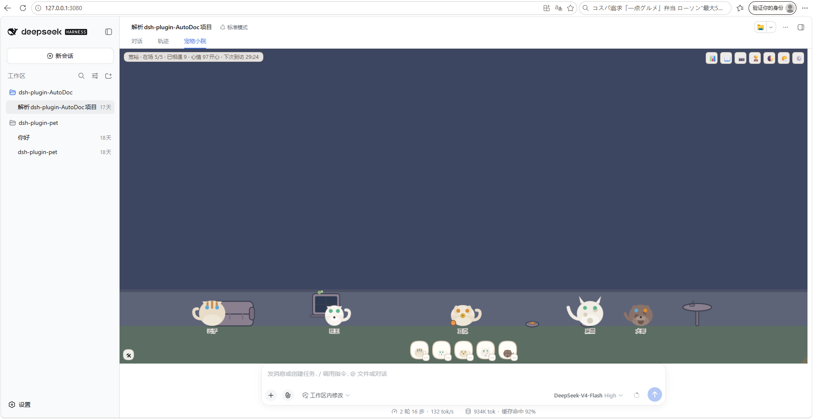

# 毛茸茸小院 · dsh-plugin-fluffy-yard

> 一个 DeepSeek Harness（dsh）宠物插件：在你的会话面板里养一座小院——
> 独一无二的猫猫狗狗会来做客，摸摸、锁定、合影、收集明信片与成就。
> 缩放面板还能看它们从悠闲到拥挤的百态，以及热情家伙们的争宠大战。

| 软萌手绘 | 几何简笔 |
|---|---|
|  |  |

## 特色

- **独一无二的家伙们**：2 物种 × 3 体型 × 4 耳型 × 10 毛色 × 5 花纹 × 4 尾巴 × 4 眼色 × 4 配饰 ≈ 7.7 万种组合，历史不重复；用尽进入「二世」轮回
- **性格驱动**：热情 / 淡定 / 高冷（出生决定），日常动作、争宠、冷场各有表现
- **争宠机制**：面板缩放驱动分档行为——宽裕散步、拥挤探头、狭小卡位、聚光灯轮换、极小压扁；点名上台、锁定皇冠、冷场哈欠传染
- **生活感**：家具小院（墙窗沙发桌）、食盆水碗（点击添食）、宠物互动（贴贴/追逐/玩球）、昼夜与天气
- **收藏闭环**：档案卡 PNG 导出、全员合影（水印=日期+第 N 次探望）、图鉴与明信片、14 项成就、连续探望统计
- **双美术风格**：几何简笔 / 软萌手绘，随时切换（存档内生效）
- 零第三方运行时依赖；数据存于浏览器 localStorage

## 安装（需要 dsh ≥ 0.1.1；已在 0.1.1-rc.2 与 0.1.5-rc.1 上验证）

### 方式 A：Release tarball（推荐——免构建、免脚本授权）

```sh
# 下载 Release 附件 dsh-plugin-fluffy-yard-0.1.0.tgz 后：
dsh plugin --profile pets add ./dsh-plugin-fluffy-yard-0.1.0.tgz
```

### 方式 B：直接从 GitHub 安装（跟随最新）

```sh
dsh plugin --profile pets add github:DaXYao/dsh-plugin-fluffy-yard
# pnpm ≥10 会要求为 prepare 构建脚本授权：
# 按提示把 pnpm 打印的包键写入该 profile 的 pnpm-workspace.yaml：
#   allowBuilds:
#     dsh-plugin-fluffy-yard: true
# 然后重新执行上面的 add 命令
```

### 两种方式都要做的最后一步（重要）

```sh
# 编辑 ~/.dsh/profiles/pets/package.json，把 Web UI 加入 bundles（置于本包之前）：
#   "dsh": { "profile": { "bundles": [
#     "@deepseek-ai/dsh-base",
#     "@deepseek-ai/dsh-web-app",     ← 加这一行
#     "dsh-plugin-fluffy-yard"
#   ] } }
dsh --profile pets        # 打开终端打印的 URL，进入会话后切到「宠物小院」标签
```

> 已知事项：清除浏览器站点数据会丢失小院存档（导出的 PNG 不受影响）；
> 探望统计按自然日计，同一浏览器多标签页同时打开时以最后保存为准。

## 从源码开发

```sh
git clone https://github.com/DaXYao/dsh-plugin-fluffy-yard && cd dsh-plugin-fluffy-yard
npm install
npm run bundle          # 产出 lib/（index.js + client.js）
npm run typecheck && npm run test
dsh plugin --profile dev add "$(pwd)"
# （dev profile 同样需要 bundles 含 @deepseek-ai/dsh-web-app）
npm run watch           # tsdown --watch；dsh 端 HMR 自动热替换
```

调试：院角 🛠 调参台（宽度/高度精确调参、立即到访、时间快进、演示/冷场存档、状态快照、立绘画廊）。

## 结构

src/core（领域内核，纯逻辑 150+ 单测）· src/client/stage（舞台引擎：档位/争宠/家具/粒子）·
src/client/render（双美术风格 + 档案卡/合影）· src/client/ui（面板/图鉴/成就/画廊）。
文档在 docs/（需求、总实现计划、P0–P6 执行手册与验收报告、发布方案与兼容核查）。

## License

MIT
